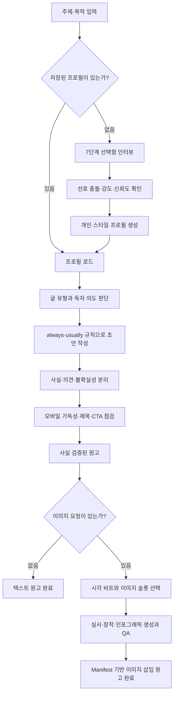
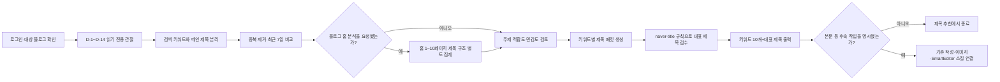
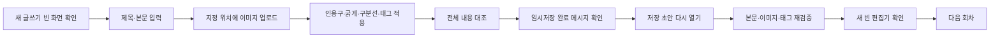

<div align="center">

# 🟢 Naver Blog Style Skill


### 선택형 인터뷰로 나만의 문체를 만들고, SEO 시리즈 작성부터 네이버 SmartEditor 임시저장까지 연결하는 블로그 스킬 모음

<p>
  <a href="./SKILL.md">
    
  </a>
  <a href="./docs/naver-blog-style-profile.md">
    
  </a>
  <a href="./references/choice-question-bank.md">
    
  </a>
  <a href="./references/visual-composition-workflow.md">
    
  </a>
</p>

<p>
  <a href="https://github.com/coreline-ai/naver_blog_skill/commits/main">
    
  </a>
  <a href="https://github.com/coreline-ai/naver_blog_skill">
    
  </a>
  
  
</p>

**문체는 고정하고, 주제만 바꿉니다.**  
말투·리듬·근거 사용법·문단 구조를 프로필로 분리하고, 명시적으로 요청한 경우에만 실사·창작·인포그래픽을 생성해 원고에 배치합니다.

[빠른 시작](#-빠른-시작) · [핵심 기능](#-핵심-기능) · [작동 방식](#-작동-방식) · [이미지 구성](#-visual-composer) · [키워드 추천](#naver-creator-keyword-recommender) · [제목 최적화](#-제목-최적화-스킬) · [시리즈 작성](#seo-series-writer) · [SmartEditor 초안](#naver-smarteditor-drafter) · [전체 워크플로](#naver-series-workflow) · [대표 프롬프트](#skill-representative-prompts) · [파일 구조](#-파일-구조) · [사용 예시](#-사용-예시)

</div>

---

## 📌 프로젝트 소개

`naver-blog-style`은 사용자의 취향을 몇 개의 형용사로 요약하는 대신, **실제 글쓰기 행동 규칙**으로 변환하는 네이버 블로그 스타일 스킬입니다.

예를 들어 “친근하고 전문적으로 써줘”를 그대로 사용하지 않습니다. 다음처럼 재사용 가능한 규칙으로 구체화합니다.

> 첫 문단에서 독자가 궁금해할 답을 평이하게 제시하고, 직접 관찰한 차이와 공식 근거를 짧은 문장형 소제목 아래 나눈다. 전문용어는 처음 한 번만 쉽게 풀어쓴다.

주제가 맛집, 제품, 투자, 여행, 앱 리뷰로 바뀌어도 다음 요소는 안정적으로 유지할 수 있습니다.

| 고정되는 스타일 레이어 | 주제에 따라 바뀌는 콘텐츠 레이어 |
|---|---|
| 필자 페르소나와 독자 거리 | 글의 주제와 검색 의도 |
| 감정 온도와 유머 강도 | 사실, 수치, 정책, 가격 |
| 문장 길이와 문단 밀도 | 키워드와 사례 |
| 소제목과 글의 전개 방식 | 이미지와 참고 자료 |
| 근거·의견·불확실성 표현 | 글 유형과 최종 행동 |
| 제목, 강조, CTA 규칙 | 최신 정보와 발행 시점 |

> [!IMPORTANT]
> 이 프로젝트는 검색 순위나 홈피드 노출을 보장하지 않습니다. 고정 글자 수, 이미지 수, 해시태그 수 또는 알고리즘 편법을 만들어내지 않고, 원본 경험·주제 일관성·가독성·투명성을 우선합니다.

## ✨ 핵심 기능

| 기능 | 설명 |
|---|---|
| 🧭 **선택 우선 인터뷰** | 한 번에 한 가지 대비만 질문하고 A~E 선택지로 선호를 구체화합니다. |
| 🧩 **7단계 스타일 분석** | 필자 정체성부터 금지 표현과 샘플 보정까지 순서대로 확인합니다. |
| 🎚️ **강도·신뢰도 관리** | 선택, 선호 강도, 확신 수준, 근거를 분리해 모호한 답을 성급하게 규칙으로 만들지 않습니다. |
| ⚖️ **충돌 감지** | 답변이 충돌하면 임의로 평균내지 않고 대비 질문으로 해결합니다. |
| 🧠 **행동 규칙 추출** | 추상적인 수식어를 문장, 문단, 근거, 제목에 적용할 수 있는 규칙으로 변환합니다. |
| 🗂️ **4단계 규칙 분류** | 스타일을 `always`, `usually`, `optional`, `avoid`로 구분합니다. |
| 📝 **프로필 기반 작성** | 저장된 프로필을 불러와 새로운 주제의 초안과 수정본에 동일한 문체를 적용합니다. |
| 📱 **모바일 가독성** | 짧은 문단, 독립 핵심 문장, 필요한 만큼의 목록과 소제목을 사용합니다. |
| 🔎 **사실·의견 분리** | 공식 정보, 개인 관찰, 추천, 불확실한 내용을 구분합니다. |
| 🎨 **문맥 기반 이미지 구성** | 이미지가 필요한 소제목만 선별하고 실사·창작·인포그래픽을 목적에 맞게 선택합니다. |
| 🧾 **Manifest 기반 삽입** | 승인된 로컬 이미지만 명시적 슬롯에 비파괴적으로 삽입합니다. |
| 👁️ **시각 QA** | 문맥, 사실성, 손·얼굴, 글자, 브랜드, 스타일, 모바일 크롭을 확인합니다. |
| 📈 **최근 유입 키워드 추천** | 크리에이터 어드바이저의 완료된 최근 7일을 직전 7일과 비교해 주제를 정하고, 요청 시 블로그 홈 제목 구조를 보완해 대표 제목을 안전하게 추천합니다. |
| 📚 **SEO 시리즈 작성** | 니치·목차·회차별 문제 해결형 원고를 만들고 사실성과 회차 중복을 검수합니다. |
| 🧱 **네이버 정본 준비** | Markdown·구조형 JSON을 `naver-post/v1`으로 변환하고 이미지·태그·서식을 검사합니다. |
| ✍️ **안전한 순차 임시저장** | SmartEditor에서 한 편씩 입력·임시저장·재열기·빈 화면 확인 후 다음 회차로 진행합니다. |
| 🛡️ **네이버 품질 가드레일** | 키워드 반복, 복제 콘텐츠, 낚시성 제목, 과장 광고, 억지 CTA를 피합니다. |

## 🚀 빠른 시작

### 1. 저장소 복제

```bash
git clone https://github.com/coreline-ai/naver_blog_skill.git
cd naver_blog_skill
```

### 2. 핵심 파일 확인

```bash
cat SKILL.md
cat docs/naver-blog-style-profile.md
```

### 3. 에이전트에게 프로필 적용 요청

저장소를 작업 폴더로 연 뒤 다음처럼 요청합니다.

```text
SKILL.md의 네이버 블로그 스타일 스킬을 적용해줘.
docs/naver-blog-style-profile.md에 저장된 프로필을 먼저 로드하고,
주제 "[작성할 주제]"로 네이버 블로그 글을 작성해줘.
```

### 4. 새로운 프로필 만들기

```text
이 저장소의 네이버 블로그 스타일 인터뷰를 시작해줘.
한 번에 질문 하나씩 진행하고, 완료된 프로필은 기존 파일을 덮어쓰기 전에 변경안을 보여줘.
```

### 5. 이미지가 포함된 글 만들기

```text
저장된 스타일 프로필로 주제 "[작성할 주제]"의 글을 작성해줘.
사실 확인이 끝난 원고를 기준으로 대표 이미지와 필요한 본문 이미지를 만들어줘.
실사·창작·인포그래픽은 소제목의 문맥과 분위기에 맞게 선택하고,
검수에 통과한 이미지만 원고 중간에 넣어줘.
```

### 6. 시리즈를 SmartEditor 임시저장까지 연결

처음에는 브라우저를 건드리지 않는 `prepare`로 검사하고, 통과 결과를 확인한 뒤 `draft`를 별도로 요청하는 방식을 권장합니다.

```text
이 저장소의 skills/naver-series-workflow/SKILL.md를 읽고 적용해줘.
[시작 회차]부터 [종료 회차]까지 원고·이미지·태그를 먼저 prepare 해줘.
이번 단계에서는 SmartEditor를 조작하지 마.
```

준비가 끝나면 대상 URL을 지정합니다.

```text
검수가 완료된 회차를 아래 SmartEditor에 한 편씩 임시저장해줘.
각 편을 다시 열어 검증하고 새 빈 화면 확인 후 다음 편으로 진행해줘.
공개 발행과 예약 발행은 하지 마.

대상: https://blog.naver.com/블로그아이디?Redirect=Write&categoryNo=카테고리번호
```

자세한 모드, 재개 방법과 서식 매핑은 [SEO 시리즈 전체 워크플로 사용법](#naver-series-workflow)을 참고하세요.

> [!TIP]
> 이미 프로필이 있다면 인터뷰를 반복할 필요가 없습니다. 프로필 파일을 먼저 로드하고 주제, 글 유형, 독자 의도만 전달하면 됩니다.

## 🔄 작동 방식



### 인터뷰 7단계

| 단계 | 확인하는 내용 | 대표 결과 |
|---:|---|---|
| 1/7 | 필자 정체성과 독자 관계 | 페르소나, 독자와의 거리, 제공 가치 |
| 2/7 | 분위기, 감정 온도, 유머 | 밝기, 진지함, 농담, 비판 강도 |
| 3/7 | 문장 끝맺음, 단어, 리듬 | 존댓말, 문장 길이, 접속어, 강조법 |
| 4/7 | 문단, 소제목, 글의 흐름 | 도입, 전개, 결론, 목록 사용 |
| 5/7 | 근거, 의견, 비판, 불확실성 | 출처, 균형, 단정 수준, 숫자 사용 |
| 6/7 | 제목, 이미지, 링크, CTA | 제목 자극성, 캡션, 행동 요청 |
| 7/7 | 금지 패턴과 샘플 보정 | 피해야 할 말투, 사용자 샘플 기반 교정 |

질문 은행에는 최대 39개의 보정 문항이 들어 있지만, 모든 질문을 기계적으로 묻지 않습니다. 이미 확인된 항목은 건너뛰고 불확실한 대비만 추가로 질문합니다.

## 👤 현재 포함된 스타일 프로필

현재 [`docs/naver-blog-style-profile.md`](./docs/naver-blog-style-profile.md)에는 35개 인터뷰 응답을 바탕으로 만든 프로필이 포함되어 있습니다.

> **공감할 수 있는 상황에서 시작해, 쉽고 재미있게 새로운 관점을 보여주고, 공식 근거와 균형 잡힌 비교로 독자의 판단을 돕는 관찰형 리뷰어 스타일**

### 프로필 요약

| 영역 | 적용 방식 |
|---|---|
| 🗣️ 필자와 독자 | 관찰력 좋은 리뷰어, 적당히 친근한 존댓말 |
| ☀️ 분위기 | 밝고 활기차되 감정 표현은 절제 |
| 😄 유머 | 짧은 자조와 소소한 농담을 가끔 사용 |
| ✍️ 문장 | 핵심은 짧게, 중요한 설명은 충분히 작성 |
| 📱 문단 | 모바일에서 읽기 쉬운 짧은 문단 |
| 🧲 소제목 | 목차형보다 궁금증을 만드는 문장형 |
| 🔍 근거 | 공식 자료와 출처를 적극 활용하고 글 마지막에 정리 |
| ⚖️ 평가 | 장단점을 균형 있게 보여주고 선택을 강요하지 않음 |
| 🏷️ 제목 | 호기심을 만들되 본문과 정확하게 연결 |
| ✅ 마무리 | 바로 활용할 수 있는 팁이나 체크리스트 |

### 규칙 우선순위

| 분류 | 의미 | 현재 프로필의 예 |
|---|---|---|
| `always` | 항상 지켜야 하는 핵심 규칙 | 쉬운 표현, 짧은 모바일 문단, 사실과 의견 구분 |
| `usually` | 특별한 이유가 없으면 적용 | 밝은 리듬, 문장형 소제목, 마지막 체크리스트 |
| `optional` | 글에 어울릴 때만 소량 사용 | 이모지, 질문, 짧은 실패담, 수미상관 |
| `avoid` | 명시적으로 피해야 하는 패턴 | 근거 없는 단정, 과장 광고, 키워드 반복, 억지 CTA |

## 🧰 지원하는 글 유형

핵심 문체는 유지하되 글의 목적에 맞게 전개만 조정합니다.

| 유형 | 권장 흐름 |
|---|---|
| 🔍 **리뷰** | 기대 또는 상황 → 실제 관찰 → 장점과 단점 → 적합한 독자 |
| 🧭 **가이드** | 독자의 문제 → 핵심 답변 → 단계별 설명 → 체크리스트 |
| 📓 **경험 기록** | 구체적인 상황 → 변화나 발견 → 개인적인 판단 → 활용 팁 |
| 📢 **공지** | 바뀐 내용 → 적용 시점 → 대상 → 필요한 행동 |
| ⚖️ **비교** | 비교 기준 → 차이 → 장단점 → 상황별 선택 기준 |
| 🔗 **홍보·링크** | 유용한 정보 → 투명한 관계 고지 → 링크 → 과장 없는 안내 |

## 🎨 Visual Composer

Visual Composer는 사용자가 대표 이미지, 본문 이미지, 이미지 삽입을 명시적으로 요청했을 때만 실행됩니다. 일반 글쓰기 요청에서는 이미지 생성 도구를 호출하지 않습니다.

### 실행 모드

| 모드 | 요청 예시 | 출력 |
|---|---|---|
| `plan-only` | “이미지 위치와 프롬프트만 제안해줘” | 슬롯 계획, 프롬프트, alt, caption |
| `generate-and-compose` | “대표 이미지와 본문 이미지를 만들어 넣어줘” | 이미지 파일, JSON manifest, 이미지 포함 Markdown |
| `edit-existing` | “이 사진의 배경만 바꿔줘” | 기존 대상을 보존한 편집 이미지 |

### 이미지 유형 선택

| 글의 문맥 | 기본 유형 |
|---|---|
| 구체적인 사람·장소·제품·일상 상황 | `photorealistic-natural` |
| 시간·절차·비교·체크리스트 | `infographic-diagram` |
| 감정·관점·변화·추상적인 메시지 | `stylized-concept` |
| 비운영 목적의 일반 인터페이스 개념 | `ui-mockup` |

이미지 수는 고정하지 않습니다. 모든 소제목을 채우기보다 독자가 상황을 이해하기 어렵거나 정보 구조가 크게 바뀌는 지점만 선택합니다.

### 출력 구조

```text
assets/<post-slug>/
├── 01-cover.png
├── 02-section-context.png
├── 03-section-guide.png
├── article.md
├── image-manifest.json
└── article-with-images.md
```

`image-manifest.json`에는 이미지 목적, 위치, 생성 모드, 프롬프트, 대체텍스트, 캡션, 경로, 승인 상태가 기록됩니다. 원고에는 `<!-- naver-image:<slot-id> -->` 마커를 사용합니다.

승인된 이미지를 삽입하려면 프로젝트 루트에서 다음 명령을 실행합니다.

```bash
python3.11 scripts/insert_article_images.py \
  --article assets/<post-slug>/article.md \
  --manifest assets/<post-slug>/image-manifest.json \
  --out assets/<post-slug>/article-with-images.md
```

기본 실행은 원본과 기존 출력 파일을 덮어쓰지 않습니다. 기존 출력 교체가 명시적으로 필요할 때만 `--force`를 사용합니다.

> [!WARNING]
> 앱 조작법, 금융 주문, 정책 신청처럼 화면 정확성이 중요한 경우 생성형 UI를 사용하지 않습니다. 사용자 캡처나 공식 자료를 우선하고, 생성 실사가 실제 경험의 증거로 오해될 수 있으면 캡션에서 이해를 돕기 위한 이미지임을 밝힙니다.

상세 규칙: [시각 구성 흐름](./references/visual-composition-workflow.md) · [이미지 모드](./references/image-generation-modes.md) · [Manifest v1](./references/image-slot-manifest.md)

## 💬 사용 예시

<a id="skill-representative-prompts"></a>

### 스킬별 대표 프롬프트

아래 예시는 그대로 복사한 뒤 대괄호 안의 값만 작업에 맞게 바꾸면 됩니다. `SmartEditor` 관련 스킬도 별도 요청이 없으면 공개·예약 발행하지 않습니다.

#### 1. `naver-blog-style` — 저장된 문체로 단일 글 작성

```text
$naver-blog-style

docs/naver-blog-style-profile.md의 저장된 문체를 적용해
주제 "[작성할 주제]"로 네이버 블로그 글을 작성해줘.

조건:
- 첫 문단에서 독자의 핵심 질문에 답하기
- 사실·개인 의견·추천을 구분하기
- 모바일에서 읽기 쉬운 짧은 문단으로 구성하기
- 확인되지 않은 경험이나 수치를 만들지 않기
- 이미지 생성과 게시 작업은 하지 않기
```

#### 2. `naver-creator-keyword-recommender` — 최근 유입 기반 키워드와 제목 추천

```text
$naver-creator-keyword-recommender

최근 완료된 7일 데이터를 직전 7일과 비교해서
내 블로그에 적합한 키워드 10개를 추천해줘.

검색 유입에서는 글의 주제를 선정하고,
메인 유입에서는 제목 원문을 복사하지 말고 패턴만 분석해
각 키워드의 대표 추천 제목을 1개씩 만들어줘.

본문·이미지·SmartEditor 작업은 하지 마.
```

블로그 홈의 현재 제목 구조까지 선택적으로 반영하려면 다음처럼 요청합니다.

```text
$naver-creator-keyword-recommender

최근 완료된 7일 검색 유입을 직전 7일과 비교해
내 블로그에 맞는 키워드 10개를 추천해줘.
네이버 블로그 홈 1~10페이지는 원문을 복사하지 말고 제목 패턴만 분석해
각 키워드의 대표 추천 제목을 1개씩 만들어줘.

본문·이미지·SmartEditor 작업은 하지 마.
```

이 요청은 `recommend-with-home` 모드로 처리됩니다. 실행 결과에는 다음 내용만 포함됩니다.

1. 최근 7일과 직전 7일의 수집 범위·완료 상태
2. 검색 유입을 근거로 선정한 키워드 10개
3. 각 키워드의 관찰 근거와 추세 분류
4. 메인 유입과 블로그 홈의 집계 패턴을 반영한 대표 제목 1개
5. 부분 수집, 시의성, 사실 확인 필요 여부 등의 주의사항

검색 유입은 **무엇을 쓸지** 정하는 데 사용하고, 메인 유입과 블로그 홈은 **어떻게 제목을 구성할지** 판단하는 데만 사용합니다. 다른 게시물의 제목 원문이나 고유 문구를 결과에 노출하지 않으며, 확인되지 않은 숫자·인용문·경험도 새 제목에 만들지 않습니다. 최신 날짜의 일부 데이터가 지연되면 결과를 `partial`로 표시하고 상승·신규 키워드로 단정하지 않습니다.

요청문에 `본문·이미지·SmartEditor 작업은 하지 마`가 있으면 키워드와 대표 제목을 출력한 뒤 종료합니다. 이후 작업은 자동으로 이어지지 않습니다.

#### 3. `naver-title` — 검색형·홈판형·혼합형 제목 만들기

```text
$naver-title

주제 "[핵심 주제]"와 검색 의도 "[독자가 해결하려는 문제]"를 기준으로
검색형 4개, 홈판형 3개, 혼합형 3개를 만들어줘.

후보를 사실성·키워드 반복·클릭베이트 기준으로 검수하고
최종 추천 제목 1개를 골라줘.
확인되지 않은 가격·기간·경험은 만들지 마.
```

#### 4. `seo-series-writer` — 정보성 시리즈 기획과 제1편 작성

```text
$seo-series-writer

주제 "[시리즈 주제]"로 [원하는 편수]편의 SEO 정보성 시리즈를 기획해줘.
먼저 전체 목차와 제1편 본문을 작성하고,
이후에는 요청할 때 한 편씩 이어가줘.

조건:
- 각 편은 서로 다른 검색 의도와 문제를 해결하기
- 근거 없는 체험·실험·수치를 만들지 않기
- 핵심 요약과 다음 편 예고를 포함하기
- 이미지 생성과 게시 작업은 하지 않기
```

#### 5. `naver-smarteditor-drafter` — 완성 원고 검증과 순차 임시저장

```text
$naver-smarteditor-drafter

완성된 원고 경로 "[절대 경로]"를 naver-post/v1 형식으로 사전검증해줘.
검증을 통과하면 지정한 네이버 SmartEditor에 한 편씩 입력하고 임시저장해줘.

조건:
- 이미지 순서는 원고의 이미지 블록 순서를 유지하기
- H2는 말풍선형 인용구, 핵심 요약은 라인형 인용구로 적용하기
- 임시저장 후 다시 열어 내용과 다음 빈 편집기 전환을 확인하기
- 공개·예약 발행은 하지 않기
```

#### 6. `naver-series-workflow` — 시리즈 전체를 안전하게 준비

```text
$naver-series-workflow

현재 프로젝트의 [시작 회차]부터 [종료 회차]까지
네이버 블로그용 실행 패키지를 prepare 모드로 준비해줘.

조건:
- 회차별 원고·이미지·태그·naver-post/v1을 검증하기
- 각 편에 이미지 [원하는 개수]장을 사용하기
- 태그는 #과 공백을 포함해 100자 이내로 검사하기
- 상태 파일과 다음 실행 지점을 생성하기
- 이번 요청에서는 SmartEditor 입력과 발행을 하지 않기
```

#### 7. 전체 워크플로 — 최근 키워드 선정부터 글 3편 임시저장까지

아래 프롬프트는 `naver-creator-keyword-recommender` → `naver-title` → `naver-blog-style` 또는 `seo-series-writer` → `naver-series-workflow` → `naver-smarteditor-drafter`를 하나의 안전한 작업으로 연결하는 대표 예시입니다.

```text
$naver-series-workflow

로그인된 네이버 크리에이터 어드바이저에서 오늘을 제외한
최근 완료 7일 데이터를 직전 7일과 비교해줘.

검색 유입 데이터는 내 블로그에 적합한 글 주제와 키워드를 찾는 데 사용하고,
메인 유입 콘텐츠는 원문을 복사하지 말고 제목 구조와 호기심 패턴만 분석해줘.
키워드 10개와 키워드별 대표 추천 제목 1개를 먼저 만들고,
적합도·근거 충분성·중복 위험을 검토해 상위 3개를 선택해줘.

선택한 주제로 서로 독립적인 정보성 글 3편을 작성해줘.
저장된 문체 프로필이 있으면 적용하고, 없으면 범용 정보성 문체를 사용해줘.

작성 조건:
- 제목과 본문이 해결하는 질문을 일치시키기
- 확인되지 않은 경험·수치·가격·일정은 만들지 않기
- 사실·의견·추천·변동 가능 정보를 구분하기
- 모바일에서 읽기 쉬운 짧은 문단과 소제목 사용하기
- 태그는 #과 공백을 포함해 100자 이내로 만들기
- 글마다 정보 가치가 있는 이미지 5장의 위치를 먼저 설계하기
- 최종 원고를 기준으로 이미지를 생성·시각 QA하고 승인 파일만 사용하기

세 글을 naver-post/v1으로 변환하고 사전검증과 콘텐츠 검수를 완료한 뒤,
아래 SmartEditor에 한 편씩 순차 입력해 임시저장해줘.

대상 SmartEditor:
[https://blog.naver.com/블로그아이디?Redirect=Write&categoryNo=카테고리번호]

SmartEditor 규칙:
- H2 소제목은 인용구 3 말풍선형으로 적용하기
- 핵심 요약과 마무리 라벨은 인용구 2 라인형으로 적용하기
- 이미지 5장이 정본에 지정된 위치와 순서대로 들어갔는지 확인하기
- 굵게 강조와 태그가 정본과 일치하는지 확인하기
- 각 글은 임시저장 완료 메시지를 확인한 뒤 저장된 초안을 다시 열어 검증하기
- 새 글쓰기 빈 화면을 확인한 뒤에만 다음 글로 진행하기
- 기존 글과 기존 임시저장 글은 삭제하지 않기
- 공개 발행과 예약 발행은 절대 하지 않기

마지막에는 키워드 선정 결과, 선택한 제목 3개,
글별 임시저장 확인 여부와 재열기 검증 결과만 요약해줘.
```

이 프롬프트를 실행하면 다음 순서로 동작합니다.

1. 최근 7일과 직전 7일의 검색 유입을 읽기 전용으로 비교합니다.
2. 메인 유입 제목에서는 문구가 아니라 구조만 추출합니다.
3. 키워드 10개와 대표 제목을 만들고 상위 3개를 선택합니다.
4. 글 3편을 작성하고 질문 해결·구체성·태그·사실성·중복을 검사합니다.
5. 최종 원고에서 이미지 슬롯을 정하고 글마다 이미지 5장을 생성·검수합니다.
6. 원고와 승인 이미지를 `naver-post/v1` 정본으로 변환해 사전검증합니다.
7. SmartEditor에 첫 글과 이미지를 입력하고 임시저장한 뒤 다시 열어 확인합니다.
8. 빈 편집기를 확인한 후 같은 절차로 다음 글을 진행하고 공개 발행 없이 종료합니다.

> 키워드 탐색부터 원고 준비까지 연결하려면 `naver-creator-keyword-recommender` → `naver-title` → `seo-series-writer` → `naver-series-workflow` 순서로 사용할 수 있습니다. 필요한 단계만 독립적으로 호출해도 됩니다.

<details>
<summary><strong>예시 1 — 저장된 프로필로 새 글 작성</strong></summary>

```text
저장된 네이버 블로그 스타일 프로필을 로드해줘.
주제는 "오후 8시까지 가능한 국내 주식 거래"야.
최신 공식 자료를 확인하고 사실과 의견을 구분해 작성해줘.
제목은 호기심을 만들되 과장하지 말고, 마지막에는 실용 체크리스트를 넣어줘.
```

</details>

<details>
<summary><strong>예시 2 — 기존 초안을 내 스타일로 수정</strong></summary>

```text
아래 초안을 docs/naver-blog-style-profile.md 기준으로 다시 써줘.
정보는 삭제하지 말고 문단을 모바일에 맞게 줄여줘.
근거 없는 단정은 완화하고, 사실과 개인 의견을 구분해줘.
장점과 단점을 비슷한 비중으로 보여줘.

[초안 붙여넣기]
```

</details>

<details>
<summary><strong>예시 3 — 새 사용자 스타일 인터뷰</strong></summary>

```text
references/choice-question-bank.md를 참고해 내 네이버 블로그 스타일을 찾아줘.
질문은 한 번에 하나씩 A~E 선택지로 제시해줘.
4~6문항마다 지금까지 확인된 스타일과 남은 대비를 짧게 정리해줘.
```

</details>

<details>
<summary><strong>예시 4 — 엄격 적용 여부 감사</strong></summary>

```text
이 글이 저장된 스타일 프로필을 엄격하게 따랐는지 감사해줘.
always, usually, optional, avoid 기준으로 차이를 표로 정리하고,
어긋난 부분만 수정한 최종본을 만들어줘.
```

</details>

<details>
<summary><strong>예시 5 — 대표·본문 이미지 생성과 삽입</strong></summary>

```text
완성된 글의 문맥을 분석해 대표 이미지와 필요한 소제목 이미지를 생성해줘.
실사, 창작, 인포그래픽은 각 문단의 역할과 분위기에 따라 선택해줘.
실제 브랜드 UI나 증거 사진처럼 보이는 이미지는 만들지 말고,
QA를 통과한 이미지만 manifest를 이용해 원고에 삽입해줘.
```

</details>

<a id="naver-creator-keyword-recommender"></a>

## 📈 크리에이터 어드바이저 키워드 추천 스킬

[`skills/naver-creator-keyword-recommender`](./skills/naver-creator-keyword-recommender/)는 로그인된 네이버 크리에이터 어드바이저의 데이터를 읽기 전용으로 확인해 **이번 주에 쓸 주제와 키워드별 대표 제목**을 추천하는 상류 스킬입니다. 사용자가 명시하면 네이버 블로그 홈의 주요 피드 제목도 별도로 관찰해 원문이 아닌 구조만 보완합니다.

- `검색 유입 트렌드`: 무엇을 쓸지 정하는 키워드 근거
- `메인 유입 트렌드`: 인용·숫자·질문·반전·정보 공백 같은 제목 구조 근거
- `블로그 홈 1~10페이지`: 요청했을 때만 사용하는 현재 홈 피드 제목 구조 보완 신호
- 기본 추천 기간: 오늘을 제외한 완료된 최근 7일
- 비교 기간: 그보다 앞선 7일

메인 유입과 블로그 홈 제목은 검색 키워드로 섞거나 복사하지 않습니다. 블로그 홈 표본은 검색량·CTR·공식 인기 순위가 아니며, 화면의 `new`, 숫자, `-`도 의미를 확인하지 않은 상태에서 검색량이라고 해석하지 않습니다.

```text
$naver-creator-keyword-recommender
최근 완료된 7일 데이터를 직전 7일과 비교해서
내 블로그 주제와 관련된 키워드 10개와
키워드별 대표 제목 1개를 추천해줘.
본문·이미지·SmartEditor 작업은 하지 마.
```

### 결과에서 확인할 수 있는 항목

| 항목 | 의미 |
|---|---|
| 수집 상태 | 최근·직전 기간, 완료·부분 수집 여부, 누락 날짜 |
| 추천 키워드 | 검색 유입에서 반복성·최근성·기간 차이를 근거로 선정한 글 주제 |
| 관찰 근거 | 검색량이 아니라 해당 기간의 유입 목록에서 확인된 날짜와 출처 |
| 추세 분류 | `지속 관찰`, `상승 가능성`, `신규 관심 가능성` 등 근거 수준에 맞춘 표현 |
| 대표 추천 제목 | 검색 의도와 제목 패턴을 결합해 새로 작성한 제목 1개 |
| 위험도·주의사항 | 시의성, 의료·금융·법률·평판 위험, 추가 사실 확인 필요 여부 |

대표 제목은 기본적으로 핵심 키워드를 앞부분에 배치하고 질문형·방법형·비교형·정보 공백형 중 주제에 맞는 구조를 선택합니다. 메인 유입에서 인용문이나 숫자가 자주 보여도 근거가 없으면 사용하지 않으며, 블로그 홈에서 발견한 새로운 단어를 추천 키워드로 승격하지 않습니다.

다음은 블로그 홈 패턴까지 함께 사용하는 대표 요청입니다.

```text
$naver-creator-keyword-recommender

최근 완료된 7일 검색 유입을 직전 7일과 비교해
내 블로그에 맞는 키워드 10개를 추천해줘.

네이버 블로그 홈 1~10페이지는 제목 원문을 복사하지 말고
제목 패턴만 분석해 각 키워드의 대표 제목에 반영해줘.

본문·이미지·SmartEditor 작업은 하지 마.
```

실행 흐름은 다음과 같습니다.



브라우저 로그인 만료, CAPTCHA, 대상 블로그 불일치, 서비스 오류는 우회하지 않습니다. 일부 날짜·화면·홈 페이지만 관찰했으면 `partial`로 표시하고, 비교 자료가 부족하면 상승 키워드로 확정하지 않습니다. 원시 스냅샷, 홈 제목 원문과 개인화 세그먼트는 Git 제외 경로에 보관합니다.

블로그 홈 제목 구조만 보고 싶다면 다음처럼 요청할 수 있습니다. 이 모드에서는 키워드나 추천 제목을 만들지 않습니다.

```text
$naver-creator-keyword-recommender
네이버 블로그 홈 1~10페이지의 주요 피드 제목을 확인해
질문·숫자·비교·방법·후기 패턴과 위험 신호만 집계해줘.
원문 제목, 키워드, 본문은 출력하지 마.
```

기본 결과에는 키워드별 대표 제목 1개가 함께 포함됩니다. 제목을 여러 개씩 더 받으려면 다음처럼 요청합니다.

```text
추천 결과 중 2번을 선택할게.
검색형·홈판형·혼합형 제목 후보를 3개씩 만들어줘.
메인 유입 제목은 원문을 복사하지 말고 관찰된 구조만 참고해줘.
본문은 작성하지 마.
```

`키워드만`, `제목도 제외`를 명시하면 대표 제목을 생성하지 않습니다. 반면 `본문이나 글은 아직 작성하지 마`는 제목 생성을 막지 않고 본문만 비활성화합니다.

본문·이미지·SmartEditor 임시저장까지 한 번에 요청할 수도 있지만, 이때도 각 전용 스킬의 검수와 권한 경계를 그대로 적용합니다. 스킬 호출만으로 공개·예약 발행하지 않습니다.

## 🏷️ 제목 최적화 스킬

[`skills/naver-title`](./skills/naver-title/)은 주제어나 기존 제목을 받아 네이버 검색형·홈판형·혼합형 제목 후보를 만드는 독립 스킬입니다. 제목과 본문의 일치, 근거 없는 수치·경험, 키워드 반복, 클릭베이트 위험도 함께 검수합니다.

| 호출 방법 | 기본 출력 |
|---|---|
| `$naver-title` | 요청한 유형과 개수에 맞춰 생성 |
| `네이버 제목 [주제어]` | 검색형 4개·홈판형 3개·혼합형 3개·최종 추천 |
| `네이버 타이틀 [주제어]` | 검색형 4개·홈판형 3개·혼합형 3개·최종 추천 |
| `네이버 주제 [주제어]` | 검색형 4개·홈판형 3개·혼합형 3개·최종 추천 |

```text
네이버 제목 여수밤바다 브런치 카페 무료주차장
```

이 스킬은 검색 상위 노출, 홈판 선정 또는 조회수 상승을 보장하지 않습니다. 제목 목적에 맞는 후보와 검수 근거를 제공합니다.

<a id="seo-series-writer"></a>

## 📚 SEO 정보성 시리즈 작성 스킬

[`skills/seo-series-writer`](./skills/seo-series-writer/)는 **니치 선정 → 사용자가 지정한 편수의 기획 → 회차별 원고 작성 → 사실성·중복 검수**를 수행하는 독립 스킬입니다. 특정 사례나 주제에 묶이지 않고 다양한 정보성 분야에 적용하며, Google 검색·AdSense 대비 콘텐츠 품질과 네이버 홈판 제목 전략을 구분합니다.

| 스킬 | 담당 역할 |
|---|---|
| `naver-blog-style` | 개인 문체 인터뷰·적용, 명시적 요청 시 이미지 구성 |
| `naver-creator-keyword-recommender` | 최근 유입 데이터 비교·주제 후보·키워드별 대표 제목 추천 |
| `naver-title` | 네이버 검색형·홈판형·혼합형 제목 |
| `seo-series-writer` | 정보성 시리즈 기획·본문·이어쓰기·검수 |
| `naver-smarteditor-drafter` | 완성 원고 검증·SmartEditor 순차 입력·임시저장 |
| `naver-series-workflow` | 시리즈 원고·이미지 준비부터 SmartEditor 순차 임시저장·재개까지 연결 |

`seo-series-writer`는 기존 문체 프로필을 자동으로 적용하거나 변경하지 않으며 다른 스킬 없이도 독립적으로 사용할 수 있습니다.

### 저장소에서 직접 사용

저장소를 작업 폴더로 연 뒤 다음처럼 파일을 직접 로드하도록 요청합니다. 폴더를 추가한 것만으로 모든 환경에 스킬이 자동 설치되지는 않습니다.

```text
이 저장소의 skills/seo-series-writer/SKILL.md를 읽고 적용해줘.
주제 "[작성할 시리즈 주제]"로 [원하는 편수]편 목차와 제1편을 작성해줘.
확인되지 않은 체험이나 수치는 만들지 마.
```

### 설치·등록된 환경에서 호출

```text
$seo-series-writer 집 안 종이 문서 정리를 주제로
5편 목차와 제1편을 작성해줘. 법정 보관 기간 설명은 필요 없어.
```

기본 출력은 **편집자용 시리즈 안내·목차 → 제1편 본문 → 진행 메모**입니다. 원고는 문제와 답·원리·실전 적용·주의점을 다루고, 요약·다음 편 예고·관찰 질문으로 마무리합니다. 편수·목차·문체·이번 작성 범위를 지정하면 그 요청을 우선합니다.

같은 대화에서 `다음 편`, `특정 회차 재작성`, `발행 패키지`, `상태 요약`으로 이어갈 수 있습니다. 발행 패키지는 제목·키워드 후보·메타 설명·슬러그·내부 링크 후보를 본문과 분리해 제공합니다. 새 대화에는 전체 목차와 완료 요약이 필요하며, 시리즈 코드만으로 이전 원고를 기억한다고 주장하지 않습니다.

> [!IMPORTANT]
> ‘애드센스 승인용’은 콘텐츠 품질을 고려한 작성 의도입니다. 승인·검색 순위·수익을 보장하지 않고, 허구의 체험·실험·출처를 만들지 않습니다. 특정 편수나 글자 수를 승인 공식으로 취급하지 않습니다. 이 스킬은 원고를 작성하며 자동 게시·예약·이미지 생성은 수행하지 않습니다.

<a id="naver-smarteditor-drafter"></a>

## ✍️ 네이버 SmartEditor 초안 작성 스킬

[`skills/naver-smarteditor-drafter`](./skills/naver-smarteditor-drafter/)는 완성된 Markdown 또는 구조형 JSON을 `naver-post/v1`으로 변환하고, 사용자가 명시적으로 요청한 경우 로그인된 SmartEditor에 **한 편씩** 입력해 임시저장하는 독립 스킬입니다.

```text
$naver-smarteditor-drafter를 사용해 [시작 회차]부터 [종료 회차]까지 사전검증해줘.
검증에 통과하면 한 편씩 SmartEditor에 작성하고 임시저장하되 발행하지 마.
```

준비만 수행할 수도 있습니다.

```bash
python3.11 skills/naver-smarteditor-drafter/scripts/build_naver_post.py \
  --input-root /absolute/path/to/series \
  --output-root /absolute/path/to/naver-smarteditor-runs \
  --run-id prepared \
  --batch --episode-min 3 --episode-max 15 \
  --expected-images 5 --expected-tags 6 --check
```

H2 소제목은 기본적으로 SmartEditor의 `인용구 3` 말풍선형으로, `핵심 요약`은 `인용구 2` 라인형으로 매핑합니다. 이미지 위치는 Markdown의 이미지 블록 순서가 정본입니다. 이미지가 필수인 요청에서는 요구한 모든 이미지 파일의 생성·시각 QA·해시 검증이 끝나기 전 SmartEditor 입력을 시작하지 않습니다. 전체 파일 검증은 일괄 수행할 수 있지만 브라우저 작성은 회차별 임시저장과 다음 빈 편집기 확인이 끝난 뒤에만 진행합니다.

> [!IMPORTANT]
> 기존 편집 내용을 자동 삭제하거나 여러 글을 동시에 작성하지 않습니다. 이미지·저장·빈 화면 검증이 실패하면 다음 회차를 중단합니다. 공개 발행과 예약 발행은 이 스킬의 범위가 아닙니다.

<a id="naver-series-workflow"></a>

## 🚦 SEO 시리즈 전체 워크플로 사용법

[`skills/naver-series-workflow`](./skills/naver-series-workflow/)는 `seo-series-writer`와 `naver-smarteditor-drafter`를 연결하는 총괄 스킬입니다. 여러 회차의 원고와 이미지를 한 번에 검사할 수 있지만, 실제 SmartEditor 입력은 **항상 한 편씩 순차적으로** 수행합니다.

### 어떤 스킬을 호출해야 하나요?

| 하고 싶은 일 | 사용할 스킬 |
|---|---|
| 크리에이터 어드바이저에서 최근 주제 후보 찾기 | `$naver-creator-keyword-recommender` |
| 주제만 가지고 시리즈 목차와 원고 작성 | `$seo-series-writer` |
| 기존 원고 제목 후보만 생성 | `$naver-title` |
| 완성된 단일 원고를 네이버용으로 검사·임시저장 | `$naver-smarteditor-drafter` |
| 여러 회차의 작성·준비·임시저장을 하나의 흐름으로 연결 | `$naver-series-workflow` |

### 실행 모드

| 모드 | 동작 | 브라우저 변경 |
|---|---|---|
| `prepare` | 원고·이미지·태그·정본·검수 상태를 확인하고 준비 패키지 생성 | 없음 |
| `draft` | 검수 통과 회차를 SmartEditor에 입력하고 임시저장·재열기 검증 | 있음 |
| `resume` | 실행 이력과 현재 화면을 비교하고 중복 없이 다음 안전 지점부터 재개 | 있음 |
| `status` | 로컬 실행 이력과 다음 조치를 조회 | 없음 |

모드를 적지 않으면 안전한 기본값인 `prepare`로 동작합니다. `draft`와 `resume`은 사용자가 대상 블로그와 회차를 지정하고 실제 SmartEditor 조작을 명시적으로 요청한 경우에만 수행합니다.

### 사용 전 준비물

- 작성할 회차 범위 또는 기존 원고 파일 경로
- 회차별로 사용할 로컬 이미지 파일과 원하는 이미지 수
- `#`과 공백을 포함한 태그 문자열 제한. 이 프로젝트의 예시는 100자 이내입니다.
- `draft`/`resume` 실행 시 로그인된 브라우저와 정확한 블로그 글쓰기 URL
- 공개 발행 여부. 이 워크플로의 기본 범위는 **임시저장까지만**입니다.

### 방법 1 — 저장소에서 직접 사용

저장소 폴더를 Codex 작업 폴더로 연 뒤, 스킬 파일을 직접 읽도록 요청합니다. `skills/`에 폴더가 존재하는 것만으로 다른 환경에 자동 설치되지는 않습니다.

```text
이 저장소의 skills/naver-series-workflow/SKILL.md를 읽고 적용해줘.
현재 프로젝트의 [시작 회차]부터 [종료 회차]까지 네이버용으로 준비해줘.

조건:
- 각 편 이미지 [원하는 개수]장
- 태그는 #과 공백을 포함해 100자 이내
- H2는 말풍선형 인용구
- 핵심 요약 제목은 라인형 인용구
- 먼저 prepare만 실행
- SmartEditor 입력과 공개 발행은 하지 않음
```

### 방법 2 — 설치·등록된 환경에서 호출

```text
$naver-series-workflow

현재 프로젝트의 [시작 회차]부터 [종료 회차]까지 네이버용으로 준비해줘.
각 편에는 이미지 [원하는 개수]장을 사용하고 태그는 100자 이내로 검사해줘.
이번 요청은 prepare 모드로만 실행해줘.
```

### 단계 1 — 원고와 이미지 사전 준비

`prepare` 단계에서는 다음 순서로 진행합니다.

1. 사용자가 지정한 시작·종료 회차를 누락과 중복 없이 계산합니다.
2. 원고 본문, 편집 메모, 검수 자료를 서로 분리합니다.
3. 각 이미지의 존재 여부·형식·해시·순서를 검사합니다.
4. Markdown 또는 구조형 JSON을 `naver-post/v1` 정본으로 변환합니다.
5. 제목·본문·이미지 수·태그 제한·지원 서식을 검사합니다.
6. 모든 대상 회차가 통과한 경우에만 SmartEditor 실행 대기열을 준비합니다.

CLI로 준비하려면 manifest와 입출력 루트를 지정합니다.

```bash
python3.11 skills/naver-series-workflow/scripts/prepare_series.py prepare \
  --manifest /absolute/path/to/series.json \
  --input-root /absolute/path/to/series-input \
  --output-root /absolute/path/to/prepared-runs \
  --run-id review-pass-01
```

`--check`는 출력 파일을 만들지 않고 검사만 합니다. 기존 원고의 핵심 사실이나 이미지가 검토 대기 상태라면 `draft` 단계로 넘어가지 않습니다.

### 단계 2 — SmartEditor에 순차 임시저장

사전검증이 끝난 후 다음처럼 실제 작업을 명시적으로 요청합니다.

```text
$naver-series-workflow

준비와 검수가 완료된 [시작 회차]부터 [종료 회차]까지 아래 SmartEditor에
한 편씩 순차 입력하고 임시저장해줘.

대상:
https://blog.naver.com/블로그아이디?Redirect=Write&categoryNo=카테고리번호

규칙:
- 각 편 저장 후 저장된 초안을 다시 열어 검증
- 새 글쓰기 빈 화면을 확인한 뒤 다음 편 진행
- 기존 글과 기존 초안은 삭제하지 않음
- 공개 발행과 예약 발행은 하지 않음
```

회차별 실행 순서는 다음과 같습니다.



> [!IMPORTANT]
> 여러 회차의 파일 검사는 일괄 수행할 수 있지만, 브라우저 작성은 여러 창에서 동시에 진행하지 않습니다. 한 회차가 `임시저장 확인 → 재열기 검증 → 새 빈 화면 확인`까지 통과해야 다음 회차를 시작합니다.

### SmartEditor 서식 매핑

| 정본 요소 | SmartEditor 적용 |
|---|---|
| 제목 | 제목 입력란 |
| 일반 문단 | 기본 본문 컴포넌트 |
| H2 소제목 | `인용구 3` 말풍선형 |
| `핵심 요약` 제목 라벨 | `인용구 2` 라인형 |
| 강조 범위 | 굵게 서식 |
| 표·복잡한 목록 | 모바일 가독성을 고려한 문단 대체 서식 |
| 이미지 | `render_plan`에 기록된 정확한 본문 위치 |
| 마무리 구간 | 구분선 |
| 태그 | 발행 설정의 태그 입력 영역 |

태그 입력을 위해 발행 설정을 열 수 있지만, 설정 창을 여는 버튼과 최종 공개 발행 버튼을 구분합니다. 이 스킬은 최종 발행 제출을 누르지 않습니다.

### 단계 3 — 중단된 작업 재개

브라우저 종료, 로그인 만료, 업로드 결과 불확실 등의 이유로 중단되면 새로 작성하지 말고 `resume`을 사용합니다.

```text
$naver-series-workflow

이전 실행 기록과 현재 SmartEditor 상태를 먼저 대조해줘.
이미 검증된 동일 버전은 건너뛰고,
중복 작성 없이 다음 안전한 회차부터 resume 해줘.
공개 발행은 하지 마.
```

스킬은 원고 revision, 이미지 해시, 임시저장 결과, 재열기 검증 기록을 비교합니다. 저장 여부를 확인할 수 없거나 현재 화면에 식별할 수 없는 내용이 남아 있으면 자동으로 재시도하지 않고 중단합니다.

### 단계 4 — 상태만 확인

```text
$naver-series-workflow status

현재 실행 기록에서 완료 회차, 대기 회차, 실패 회차와
다음으로 수행해야 할 작업을 알려줘. 브라우저는 조작하지 마.
```

CLI 상태 조회는 다음과 같습니다.

```bash
python3.11 skills/naver-series-workflow/scripts/prepare_series.py status \
  --run-directory /absolute/path/to/prepared-run \
  --execution-root /absolute/path/to/execution-ledger
```

상태 보고에서는 `구조 검사 통과`, `콘텐츠 검수 완료`, `준비 완료`, `임시저장 확인`, `재열기 검증`, `최종 빈 화면 확인`을 서로 다른 단계로 표시합니다.

### 책임 범위

- `naver-creator-keyword-recommender`는 주제 후보와 키워드별 대표 제목을 제공하지만 원고·브라우저 편집을 대신하지 않습니다.
- `seo-series-writer`는 원고를 작성하지만 SmartEditor를 조작하지 않습니다.
- 이미지 생성은 사용자가 명시적으로 요청했을 때 별도 이미지 도구로 수행합니다.
- `naver-smarteditor-drafter`는 완성된 원고와 실제 이미지 파일만 입력합니다.
- `naver-series-workflow`는 작성·검수·입력 사이의 계약과 재개 상태를 관리합니다.
- 어떤 스킬도 AdSense 승인, 검색 상위 노출, 조회수 상승을 보장하지 않습니다.
- 기본 자동화 범위는 비공개 임시저장이며 공개·예약 발행과 기존 글 삭제는 수행하지 않습니다.

## 📂 파일 구조

```text
📦 naver_blog_skill
├── 📄 README.md
├── 🧠 SKILL.md
├── 🙈 .gitignore
├── 📁 docs
│   └── 👤 naver-blog-style-profile.md
├── 📁 references
│   ├── ❓ choice-question-bank.md
│   ├── 🎨 visual-composition-workflow.md
│   ├── 🖼️ image-generation-modes.md
│   └── 🧾 image-slot-manifest.md
├── 📁 scripts
│   └── 🔧 insert_article_images.py
├── 📁 tests
│   ├── 🧪 test_insert_article_images.py
│   ├── 🧪 test_build_naver_post.py
│   ├── 🧪 test_asset_integrity.py
│   ├── 🧪 test_execution_state.py
│   ├── 🧪 test_prepare_series.py
│   ├── 🧪 test_series_simulation.py
│   ├── 🧪 test_ui_evidence_contract.py
│   ├── 🧪 test_smarteditor_checks.mjs
│   ├── 🧪 test_creator_keyword_recommender.py
│   ├── 🧪 test_blog_home_title_analyzer.py
│   └── 📁 fixtures
├── 📁 skills
│   ├── 📁 naver-creator-keyword-recommender
│   │   ├── 🧠 SKILL.md
│   │   ├── 📁 agents
│   │   │   └── ⚙️ openai.yaml
│   │   ├── 📁 scripts
│   │   │   ├── 📊 analyze_snapshots.py
│   │   │   └── 📊 analyze_home_titles.py
│   │   └── 📁 references
│   │       ├── 🧾 data-contract.md
│   │       ├── 🧾 blog-home-data-contract.md
│   │       ├── 🖥️ browser-runbook.md
│   │       ├── 🖥️ blog-home-browser-runbook.md
│   │       ├── 🛡️ scoring-and-safety.md
│   │       ├── 🏷️ title-handoff.md
│   │       └── 📚 examples.md
│   ├── 📁 naver-title
│   │   ├── 🧠 SKILL.md
│   │   ├── 📁 agents
│   │   │   └── ⚙️ openai.yaml
│   │   └── 📁 references
│   │       ├── 📐 title-framework.md
│   │       ├── ✅ evaluation-rubric.md
│   │       └── 📚 examples.md
│   ├── 📁 seo-series-writer
│   │   ├── 🧠 SKILL.md
│   │   ├── 📁 agents
│   │   │   └── ⚙️ openai.yaml
│   │   └── 📁 references
│   │       ├── 🔄 series-workflow.md
│   │       ├── 📝 article-template.md
│   │       ├── 🛡️ quality-policy.md
│   │       ├── ✅ evaluation-rubric.md
│   │       └── 📚 examples.md
│   ├── 📁 naver-smarteditor-drafter
│   │   ├── 🧠 SKILL.md
│   │   ├── 📁 agents
│   │   │   └── ⚙️ openai.yaml
│   │   ├── 📁 scripts
│   │   │   ├── 🔧 build_naver_post.py
│   │   │   ├── 🔐 asset_integrity.py
│   │   │   ├── 🧾 post_contract.py
│   │   │   ├── 🗃️ execution_state.py
│   │   │   └── 🔎 smarteditor_checks.mjs
│   │   └── 📁 references
│   │       ├── 🧾 naver-post-v1.md
│   │       ├── 🖥️ smarteditor-runbook.md
│   │       └── 🛡️ recovery-and-safety.md
│   └── 📁 naver-series-workflow
│       ├── 🧠 SKILL.md
│       ├── 📁 agents
│       │   └── ⚙️ openai.yaml
│       ├── 📁 scripts
│       │   └── 🔧 prepare_series.py
│       └── 📁 references
│           ├── 🧾 series-contract.md
│           └── 🔄 workflow-runbook.md
└── 📁 assets                         # 로컬 생성 이미지, Git 추적 제외
```

| 파일 | 역할 |
|---|---|
| [`SKILL.md`](./SKILL.md) | 인터뷰, 스타일 추출, 프로필 적용, 네이버 가드레일을 정의하는 핵심 스킬 |
| [`docs/naver-blog-style-profile.md`](./docs/naver-blog-style-profile.md) | 확인된 개인 문체와 작성 규칙을 저장하는 재사용 프로필 |
| [`references/choice-question-bank.md`](./references/choice-question-bank.md) | 7개 차원의 선택형 질문과 샘플 보정 문항 |
| [`references/visual-composition-workflow.md`](./references/visual-composition-workflow.md) | 이미지 위치 선정, 생성, QA, 삽입 순서 |
| [`references/image-generation-modes.md`](./references/image-generation-modes.md) | 실사·창작·인포그래픽·UI 개념 이미지의 선택 기준 |
| [`references/image-slot-manifest.md`](./references/image-slot-manifest.md) | JSON v1 슬롯 계약, 마커 문법, 검증 실패 조건 |
| [`scripts/insert_article_images.py`](./scripts/insert_article_images.py) | 승인된 이미지를 Markdown 슬롯에 삽입하는 비파괴 CLI |
| [`tests/test_insert_article_images.py`](./tests/test_insert_article_images.py) | 경로·슬롯·특수문자·비덮어쓰기 단위 테스트 |
| [`skills/naver-creator-keyword-recommender/`](./skills/naver-creator-keyword-recommender/) | 최근·직전 검색 유입을 비교하고 요청 시 블로그 홈 제목 구조를 별도로 보완하는 독립 스킬 |
| [`skills/naver-creator-keyword-recommender/scripts/analyze_snapshots.py`](./skills/naver-creator-keyword-recommender/scripts/analyze_snapshots.py) | 로컬 관찰 JSON을 검증하고 근거 점수·제목 패턴 집계를 생성하는 결정적 CLI |
| [`skills/naver-creator-keyword-recommender/scripts/analyze_home_titles.py`](./skills/naver-creator-keyword-recommender/scripts/analyze_home_titles.py) | 블로그 홈 제목 스냅샷을 검증하고 원문 없는 구조·길이·민감도 집계를 생성하는 결정적 CLI |
| [`skills/naver-title/`](./skills/naver-title/) | 검색형·홈판형·혼합형 제목을 생성하고 사실성·키워드 남용·클릭베이트를 검수하는 독립 스킬 |
| [`skills/seo-series-writer/`](./skills/seo-series-writer/) | 니치 선정·시리즈 목차·문제 해결형 원고·회차 이어쓰기·사실성 검수의 독립 스킬 |
| [`skills/naver-smarteditor-drafter/`](./skills/naver-smarteditor-drafter/) | 완성 원고를 검증하고 SmartEditor에 순차 입력·임시저장하는 독립 스킬 |
| [`skills/naver-smarteditor-drafter/scripts/build_naver_post.py`](./skills/naver-smarteditor-drafter/scripts/build_naver_post.py) | Markdown·구조형 JSON을 `naver-post/v1`과 사전검증 보고서로 변환하는 CLI |
| [`skills/naver-smarteditor-drafter/scripts/execution_state.py`](./skills/naver-smarteditor-drafter/scripts/execution_state.py) | 회차별 입력·저장·재열기·빈 화면 이벤트와 writer lease를 관리하는 실행 저장소 |
| [`skills/naver-smarteditor-drafter/scripts/smarteditor_checks.mjs`](./skills/naver-smarteditor-drafter/scripts/smarteditor_checks.mjs) | 기대 정본과 실제 SmartEditor 관찰값을 비교하는 검사기 |
| [`skills/naver-series-workflow/`](./skills/naver-series-workflow/) | 시리즈 원고·이미지 준비, 검수 게이트, SmartEditor 순차 임시저장·재개를 연결하는 총괄 스킬 |
| [`skills/naver-series-workflow/scripts/prepare_series.py`](./skills/naver-series-workflow/scripts/prepare_series.py) | `naver-series/v1` manifest를 검사하고 불변 준비 run과 상태 보고서를 만드는 CLI |
| [`.gitignore`](./.gitignore) | `.DS_Store`, 로컬 이미지와 비공개 크리에이터 어드바이저 관찰 데이터를 버전 관리에서 제외 |
| `assets/` | 생성한 대표 이미지와 본문 이미지를 로컬에서 보관하는 폴더 |

## 🧪 프로필 적용 품질 점검

글을 발행하기 전에 다음 항목을 확인합니다.

- [ ] 도입부가 독자의 실제 상황이나 즉각적인 질문에서 시작하는가?
- [ ] 제목이 호기심을 만들면서 본문 내용을 정확히 반영하는가?
- [ ] 문단이 모바일에서 읽기 부담스럽지 않은가?
- [ ] 다른 글에서 놓치기 쉬운 관찰이나 차이가 한 가지 이상 있는가?
- [ ] 공식 정보, 확인된 사실, 개인 의견이 구분되어 있는가?
- [ ] 장점과 단점을 한쪽으로 몰지 않고 균형 있게 다뤘는가?
- [ ] 사람마다 달라질 수 있는 내용에 적절한 여지를 남겼는가?
- [ ] 중요한 정보를 이미지에만 넣지 않고 본문에도 작성했는가?
- [ ] 키워드 반복, 낚시성 제목, 과장 광고 표현을 제거했는가?
- [ ] 마지막에 독자가 바로 활용할 팁이나 체크리스트가 있는가?
- [ ] 억지스러운 댓글, 구매, 방문 유도가 없는가?

## 🛡️ 네이버 콘텐츠 가드레일

이 스킬은 네이버 서치어드바이저의 콘텐츠 품질 권장 사항을 참고합니다.

- 직접 경험과 전문성을 바탕으로 작성합니다.
- 블로그의 핵심 주제와 글의 정체성을 가능한 한 일관되게 유지합니다.
- 복사, 짜깁기, 출처 없는 소문을 피합니다.
- 제목, 소제목, 문단, 목록으로 필요한 정보를 빠르게 찾게 합니다.
- 중요한 정보는 이미지 안에만 넣지 않고 텍스트로도 작성합니다.
- 변경 가능성이 큰 정책, 가격, 일정은 최신 자료로 확인합니다.
- 내용과 무관한 인기 키워드와 낚시성 제목을 사용하지 않습니다.

공식 참고 자료: [네이버 서치어드바이저 — 콘텐츠 작성 시 권장 사항](https://searchadvisor.naver.com/guide/content-basic)

## 🧩 프로필 수정 방법

프로필을 변경할 때는 [`docs/naver-blog-style-profile.md`](./docs/naver-blog-style-profile.md)에서 다음 영역을 수정합니다.

1. 한 문장 정체성
2. 필자와 독자의 관계
3. 분위기와 감정
4. 문장과 문단
5. 글의 구조와 흐름
6. 정보·근거·평가
7. 제목·이미지·키워드
8. `always / usually / optional / avoid` 규칙
9. 중립 예시
10. 발행 전 체크리스트

> [!WARNING]
> 기존 프로필을 수정할 때는 바로 덮어쓰기보다 변경 전·후 차이를 먼저 비교하세요. 한 번의 모호한 선호보다 반복된 응답이나 실제 사용자 문장에 더 높은 신뢰도를 부여하는 것이 좋습니다.

## 🚫 하지 않는 것

- 검색 상위 노출 또는 홈피드 노출을 보장하지 않습니다.
- 근거 없는 알고리즘 공식을 만들어내지 않습니다.
- 모든 글에 같은 글자 수와 이미지 수를 강제하지 않습니다.
- 키워드를 정해진 횟수만큼 반복하지 않습니다.
- 사용자 경험이 없는 내용을 실제 경험처럼 꾸미지 않습니다.
- 협찬, 광고, 제휴 관계를 숨기도록 안내하지 않습니다.
- 사실 확인이 필요한 정보를 추측만으로 단정하지 않습니다.

## ❓ FAQ

### 프로필이 있으면 인터뷰를 다시 해야 하나요?

아닙니다. 저장된 프로필을 불러오고 새 주제와 목적만 전달하면 됩니다. 말투가 달라졌거나 기존 결과가 만족스럽지 않을 때만 특정 차원을 다시 보정합니다.

### 질문 39개를 전부 답해야 하나요?

아닙니다. 질문 은행은 불확실한 선호를 해결하기 위한 최대 범위입니다. 이미 확인된 항목은 건너뛰며, 필요한 질문만 선택합니다.

### 어떤 주제에도 사용할 수 있나요?

리뷰, 가이드, 경험담, 비교, 공지처럼 대부분의 블로그 글에 적용할 수 있습니다. 금융·의료·법률처럼 정확성이 중요한 주제는 최신 공식 자료 확인이 추가로 필요합니다.

### 여러 편을 동시에 SmartEditor에 작성하나요?

아닙니다. 파일 준비와 사전검사는 여러 편을 일괄 처리할 수 있지만, SmartEditor 입력은 한 편씩 진행합니다. 한 회차의 임시저장, 재열기 검증, 다음 빈 화면 확인이 모두 끝난 뒤 다음 회차를 시작합니다.

### 기존 Markdown 원고를 그대로 사용할 수 있나요?

가능합니다. `naver-smarteditor-drafter`가 지원 구조를 검사하고 `naver-post/v1` 정본으로 변환합니다. 이미지 경로, 태그 제한, H2·인용구·굵게 등 지원 서식에 문제가 있으면 SmartEditor 조작 전에 실패로 보고합니다.

### 작업이 중간에 끊기면 처음부터 다시 작성하나요?

아닙니다. `resume` 모드에서 원고 revision, 이미지 해시, 저장 및 재열기 이벤트와 현재 화면을 대조합니다. 동일 버전의 검증된 초안은 건너뛰며, 저장 여부가 불확실하면 중복 작성을 피하기 위해 자동 재시도하지 않습니다.

### 임시저장 후 자동으로 공개 발행되나요?

아닙니다. SmartEditor 스킬의 자동화 범위는 비공개 임시저장과 재검증까지입니다. 발행 설정은 태그 입력을 위해 열 수 있지만 최종 공개·예약 발행 버튼은 누르지 않습니다.

### 이미지도 저장소에 함께 올라가나요?

기본적으로 `assets/`는 `.gitignore`에 포함되어 Git 추적에서 제외됩니다. 이미지를 배포하려면 용량, 저작권, 저장 위치를 검토한 뒤 별도 정책으로 추가하세요.

### 이 스킬을 사용하면 노출이 보장되나요?

아닙니다. 이 스킬의 목적은 글의 원본성, 일관성, 가독성, 투명성을 높이는 것입니다. 실제 노출은 플랫폼의 다양한 조건에 따라 달라질 수 있습니다.

## 🤝 기여하기

오탈자 수정, 선택지 개선, 새로운 글 유형 어댑터 제안은 이슈 또는 Pull Request로 제출할 수 있습니다.

```bash
git checkout -b feature/your-change
git add .
git commit -m "Describe your change"
git push origin feature/your-change
```

기여 시 다음 원칙을 권장합니다.

- 질문 선택지가 특정 답을 정답처럼 유도하지 않아야 합니다.
- 추상적인 형용사보다 실제 글쓰기 행동을 설명해야 합니다.
- 기존 개인 프로필과 범용 스킬 워크플로를 혼합하지 않아야 합니다.
- 새로운 규칙은 `always`, `usually`, `optional`, `avoid` 중 하나로 분류할 수 있어야 합니다.
- 플랫폼 노출을 보장하거나 확인되지 않은 편법을 추가하지 않아야 합니다.

## 🗺️ 확장 아이디어

- [ ] 리뷰·가이드·비교 글의 세부 어댑터 확장
- [ ] 프로필 변경 이력과 버전 관리 방식 추가
- [ ] 샘플 원고 기반 문장 리듬 비교 리포트
- [ ] 발행 전 자동 체크리스트 템플릿
- [ ] 제목 후보와 본문 일치도 점검 방식
- [x] 이미지 삽입 위치와 캡션 가이드

> 확장 아이디어는 현재 구현을 보장하는 로드맵이 아니라 향후 검토 가능한 제안 목록입니다.

## 📄 라이선스

현재 저장소에는 별도의 `LICENSE` 파일이 포함되어 있지 않습니다. 외부 배포, 수정, 재사용 조건이 필요한 경우 저장소 소유자가 라이선스 정책을 먼저 추가해야 합니다.

## 🔗 참고 링크

- [네이버 서치어드바이저 — 콘텐츠 작성 시 권장 사항](https://searchadvisor.naver.com/guide/content-basic)
- [GitHub Docs — About READMEs](https://docs.github.com/en/repositories/managing-your-repositorys-settings-and-features/customizing-your-repository/about-readmes)
- [GitHub Docs — Creating diagrams](https://docs.github.com/en/get-started/writing-on-github/working-with-advanced-formatting/creating-diagrams)

---

<div align="center">

### 좋은 스타일은 화려한 말투보다 반복 가능한 선택에서 만들어집니다.

**Naver Blog Style Skill** · Profile-driven · Evidence-aware · Visual-aware · Mobile-readable

</div>
